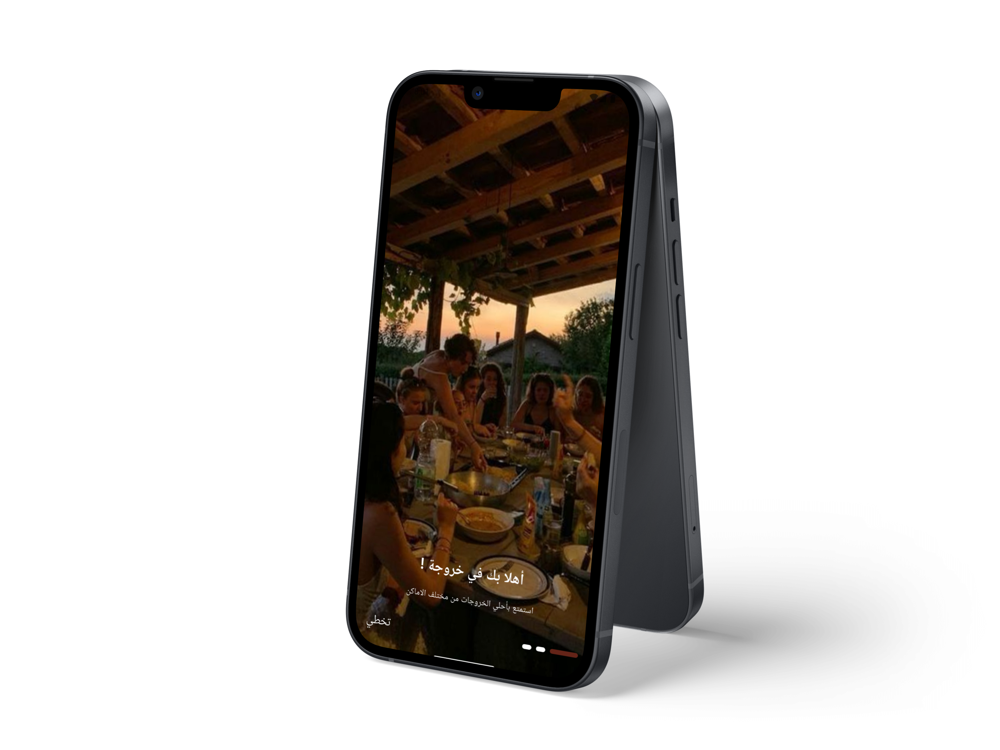
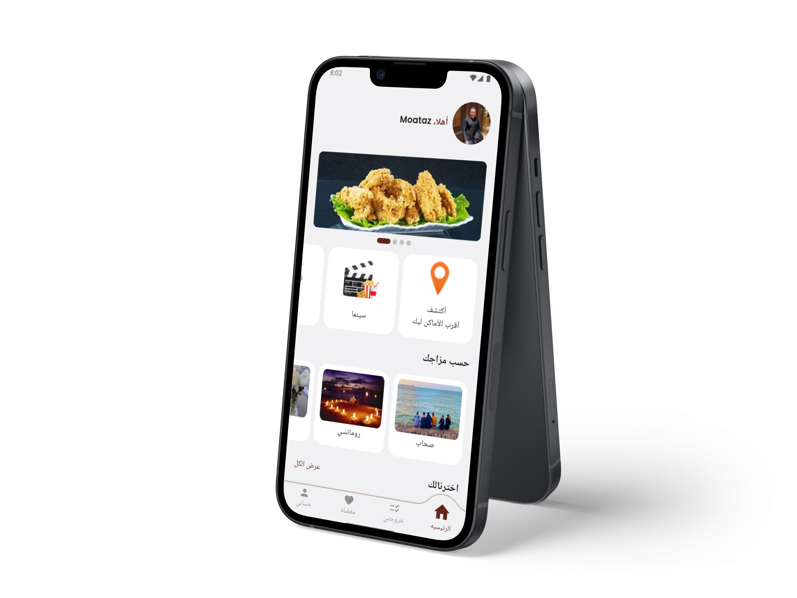
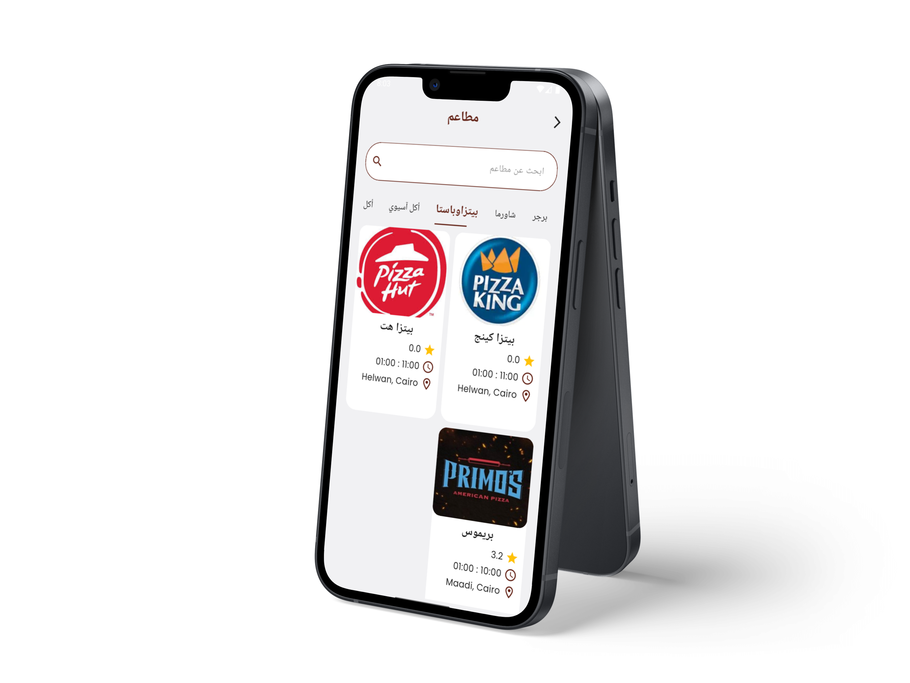
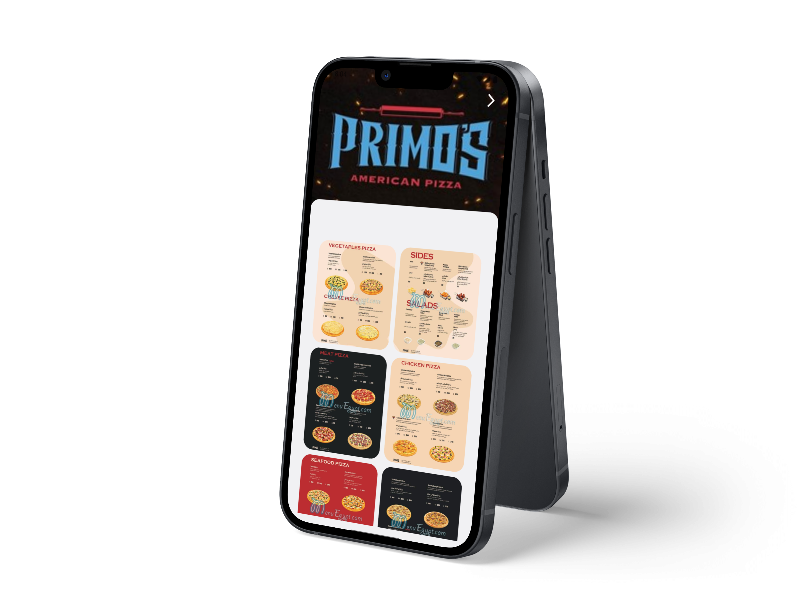
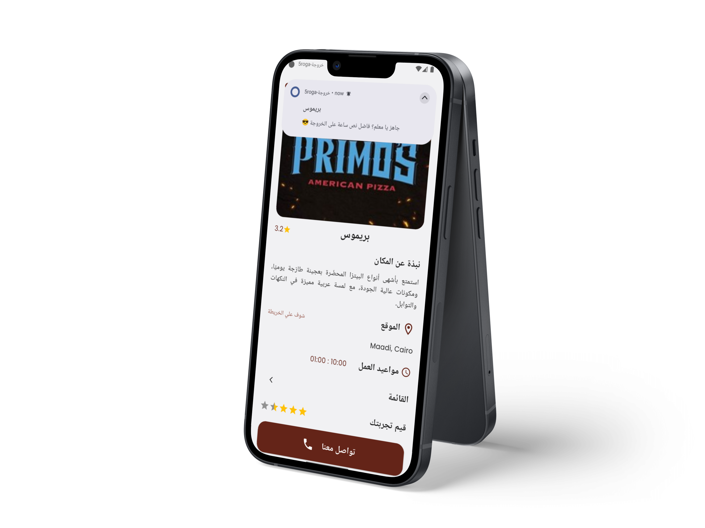
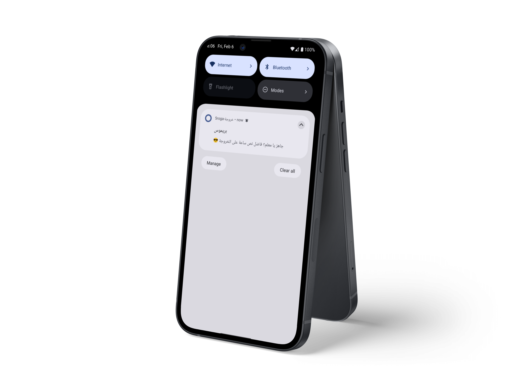
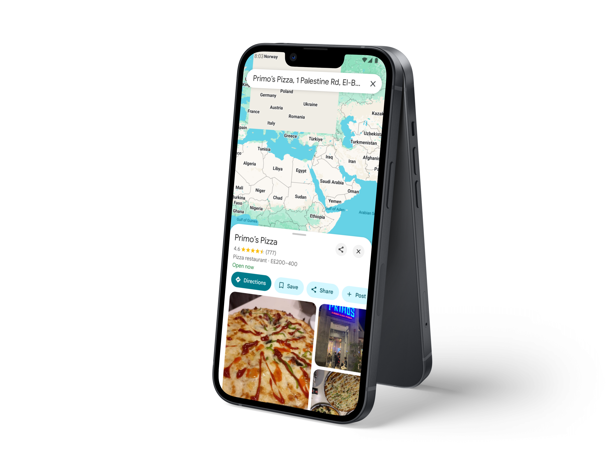
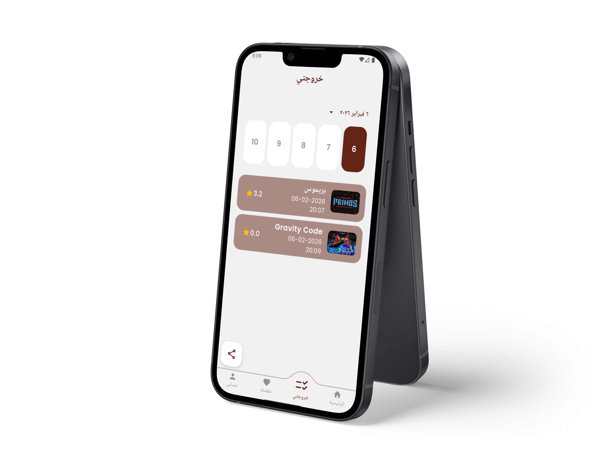
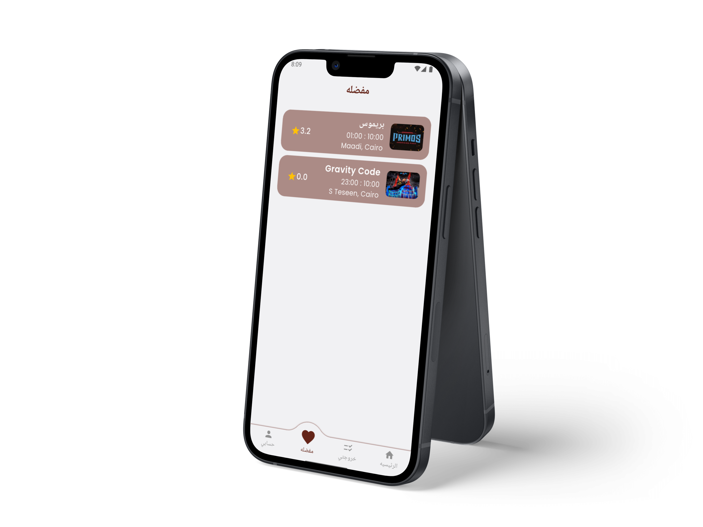
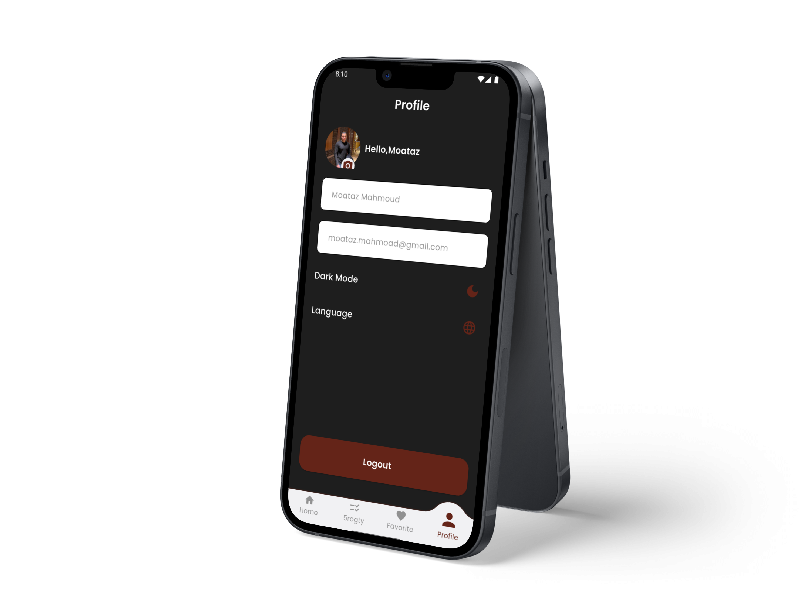

# 5roga - خروجة 🎉

**5roga (خروجة)** is a Flutter-based mobile application that helps users plan their outings easily — from choosing the place and time, to activities, entertainment, reminders, and sharing plans with friends.

---

## 🚀 App Concept
The app solves the common question: **"Where should we go and when?"** 😄

With 5roga, users can:
- Create an outing **Plan**
- Choose **place, date, and time**
- Select the type of outing (cinema, restaurant, café, games, amusement parks, kids activities, etc.)
- Receive **scheduled notifications** as reminders
- Share their plan with friends

---

## ✨ Features

### 🗺️ Places & Activities
- Browse different types of places:
  - 🎬 Cinemas  
  - 🍽️ Restaurants  
  - ☕ Cafés  
  - 🎮 Games & entertainment venues  
  - 🎡 Amusement parks  
  - 🧸 Kids & family activities
- View full place details
- Open location directly in **Google Maps**
- Contact the place via phone call
- Rate places using a star rating system

### 📅 Planning
- Create a personalized outing plan
- Select date & time
- Schedule reminder notifications
- Custom notification sound 🔔

### 🔔 Notifications
- Local notifications with precise timing
- Scheduled motivational notifications (e.g. every Saturday to encourage users to plan an outing)
- Background scheduling using WorkManager

### 🌗 UI / UX
- Clean & modern UI
- **Dark Mode** support
- Full **English & Arabic** localization
- Smooth animations & shimmer loading

### 📸 Share Plan
- Take an in-app **screenshot** of the plan
- Share the plan instantly with friends via social apps

### ❤️ Favorites
- Save favorite places
- Quick access to preferred spots

### 👤 Profile
- User profile screen
- Language switching (English / Arabic)
- Dark mode toggle

### 🔐 Authentication & User Roles
- Firebase Authentication
- Google Sign-In

#### 👥 User Types
- **Regular User**
  - Browse places & activities
  - Create and manage outing plans
  - Receive notifications
  - Rate & favorite places
  - Share plans with friends

- **Admin User**
  - Add new places & activities
  - Update place details (category, menu, games, location, contact info)
  - Manage places stored in Firestore

---

## 🗂️ Project Structure

```
lib/
│
├── core/
│   ├── constants/
│   ├── routes/
│   ├── utils/
│   └── services/
│
├── features/
│   ├── auth/
│   ├── onboarding/
│   ├── home/
│   ├── places/
│   ├── place_details/
│   ├── plan/
│   ├── favorites/
│   ├── notifications/
│   └── profile/
│
├── main.dart
└── app.dart
```
---

## 🖼️ Screenshots

### 🚀 Onboarding Flow
| Onboarding | Onboarding | Onboarding |
|------------|------------|------------|
|  |  |  |

### 🏠 Main Application Screens
| Home | Places | Menu | Place Details | Notifications | Google Maps |
|------|--------|------|---------------|---------------|-------------|
|  |  |  |  |  |  |

### 📅 Planning & User Screens
| Plan | Favorites | Profile |
|------|-----------|---------|
|  |  |  |


---

## ⚙️ Setup & Run

```bash
flutter pub get
flutter run
```

## 🌍 Localization
- English 🇺🇸
- Arabic 🇪🇬

---

🛠️ Future Enhancements

 - Push Notifications (FCM)

 - Social plans with friends

 - Smart outing suggestions

 - Calendar integration

## 👨‍💻 Developer
**Moataz Mahmoud**  
Flutter Developer

---

## ⭐ Support
If you like this project, don’t forget to give it a ⭐ on GitHub!
